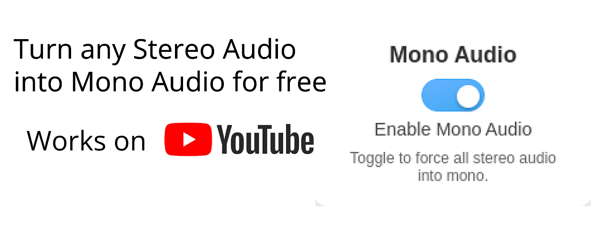

<!--
  Replace the image URL below with the location of your banner/logo.
  You can also adjust the width or remove it entirely if you prefer.
-->

  

<h1 align="center">StereoToMono</h1>

  <b>Force all stereo audio into mono with a single toggle.</b>

<!-- Badges / Tags -->

  <!-- Version badge example -->
  
  <!-- License badge example -->
  
  <!-- Issues badge example -->
  
  <!-- Chrome Web Store badge example (replace with your extension ID) -->
  

---

## About

**StereoToMono** is a simple Chrome extension that merges any stereo audio into a single mono channel. Whether you’re wearing headphones or using a single speaker, enjoy consistent sound from all tabs with a click of a button.

**Key Features**:
- Toggles between stereo and mono modes quickly.
- Works on any website with audio or video elements.
- Zero data collection – only stores a single on/off preference.

---

## Installation

1. **Install via the Chrome Web Store**  
   [StereoToMono on Chrome Web Store](https://chrome.google.com/webstore/detail/stereotomono/abcd1234efgh5678)

2. **Or Load Unpacked**  
   - Download/cloning this repository.  
   - Go to `chrome://extensions`, enable **Developer Mode**.  
   - Click **“Load unpacked”** and select the project folder.  

Once installed, click the extension icon, enable **“Mono Audio,”** and enjoy!

---

## Usage

1. **Toggle On**: Click the extension icon → turn on “Enable Mono Audio.”  
2. **Toggle Off**: Click again and disable mono mode.  
3. (Optional) Refresh any active pages for the setting to fully apply or remove.

---

## Contributing

Contributions, issues, and feature requests are welcome! Feel free to check the [issues page](https://github.com/YourUser/StereoToMono/issues) to see what’s on our plate or propose a new idea.

---

## License

Distributed under the [MIT License](LICENSE).  
Feel free to modify and distribute as needed.

---
